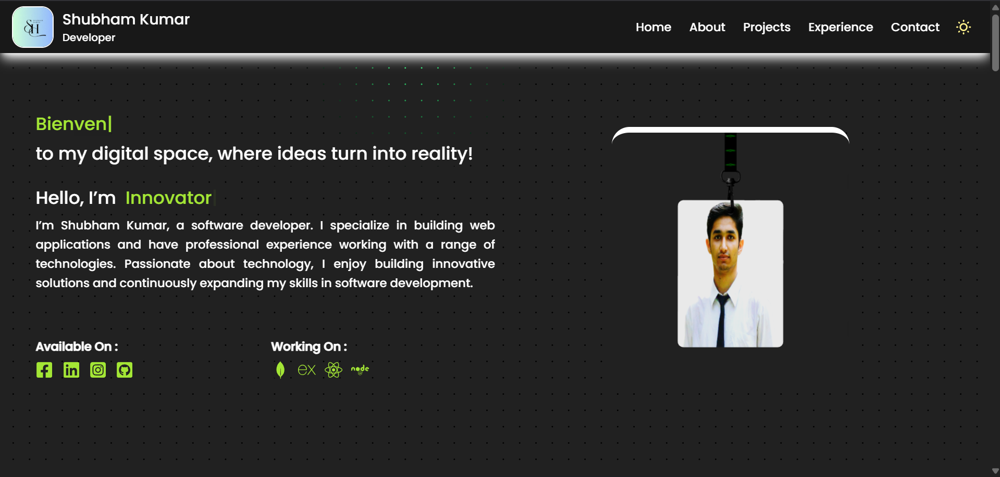
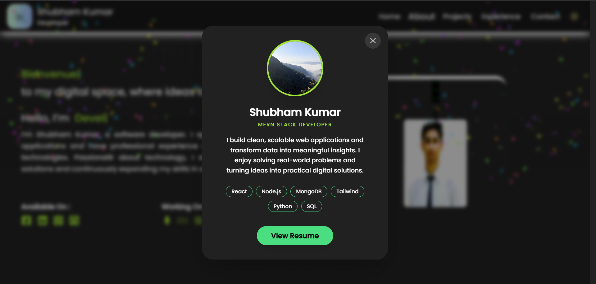
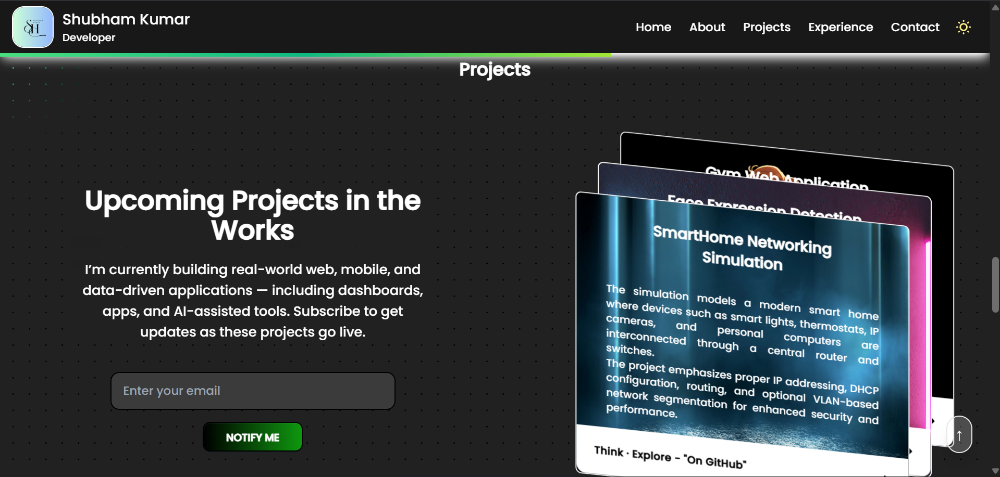
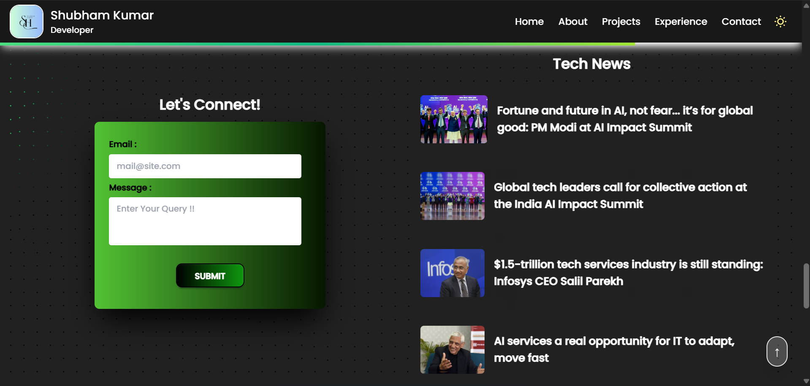

# 🌐 Portfolio Website — Version 1 (Showcase Only)

This repository showcases **Version 1** of my personal portfolio website.  
It includes project details, features, screenshots, and tech stack information.  
The actual source code is kept **private**, as I am currently developing an upgraded Version 2 with a modern UI/UX.

🚀 **Live Demo:**  
https://darkdev-sk.netlify.app/

---

## 📌 Overview

Portfolio V1 is a clean and responsive personal website designed to highlight my skills, experience, and projects as a developer.  
This version focuses on simplicity, fast performance, and smooth UI sections.

This repository contains:
- ✔ Project documentation  
- ✔ Screenshots  
- ✔ Feature list  
- ✔ Tech stack  
- ✖ **No source code** (kept private intentionally)

---

## ✨ Features

- 🏠 **Home / Hero Section** — clean intro with a professional look  
- 👤 **About Section** — brief introduction and background  
- 🛠 **Skills Section** — technologies and tools I work with  
- 💼 **Projects Section** — list of my work with live links  
- 📞 **Contact Section** — message option or contact details  
- 📱 **Fully Responsive** — works on desktop, tablet, and mobile  
- ⚡ **Fast & Lightweight** — optimized React + Tailwind setup  

---

## 🛠️ Tech Stack

- **React.js**
- **Node.js**
- **JavaScript (ES6+)**
- **Tailwind CSS**
- **Netlify** (Deployment)

---

## 📷 Screenshots

> Add your screenshots inside the `/screenshots` folder.

| Section | Preview |
|--------|---------|
| Home |  |
| About |  |
| Projects |  |
| Contact |  |
| Mobile View |  |

---

## 🔒 Why is the Code Private?

The source code for Version 1 is intentionally kept private because:

- I am currently building **Version 2** with major improvements  
- I want to maintain uniqueness and prevent unauthorized reuse  
- This repo exists only to **showcase** the project, not share code  

When Version 2 is live, its showcase will also be public (code will still remain private).

---

## 🚀 Upcoming Version 2 (In Progress)

Version 2 of my portfolio will include:

- 🎨 Completely new UI design  
- 🌙 Dark / Light theme  
- ✨ Smoother animations  
- ⚡ Better performance  
- 📊 Enhanced project presentation  
- ⭐ More interactive components  

Stay tuned!

---

## 📬 Contact

If you'd like to connect, collaborate, or discuss anything, feel free to reach out:

- **Email:** shubhamkumar65604@gmail.com  
- **LinkedIn:** https://www.linkedin.com/in/shubham-kumar-11866221a/
- **GitHub:** https://github.com/Shubhamkumar6560 

---

### ⭐ Thank you for checking out my Portfolio Showcase!
